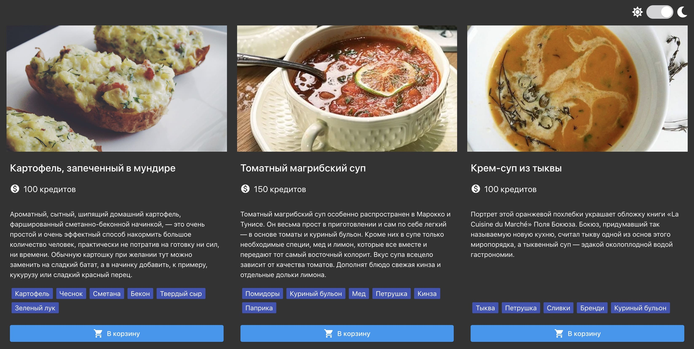

# Admission criteria

- The 'goit-js-hw-10-food-service` repository has been created.
- When submitting homework, there are two links: to the source files and the work
page on GitHub Pages.
- When visiting the work page (GitHub Pages) of the task, there are no errors and
warnings in the console.
- The names of variables and functions are clear, descriptive.
- The project is built using `Webpack` or `Parceljs'.
- The code is formatted `Prettier'.

# Task

Create a menu page with the ability to choose a theme for the food ordering service.
[Link to demo video](https://take.ms/RxIlv ).



- Be sure to use 'Webpack` or `Parceljs` to build and deploy (
  [link to the finished Webpack build](https://github.com/luxplanjay/webpack-starter-kit ))
- In the folder [src](./src) you will find the starting markup, styles and data
- An array of dish objects lies in [menu.json](./src/menu.json)

## Subject

Add the functionality of changing the theme when you click (the `change` event) on the checkbox
`#theme-switch-toggle` in the toolbar.

- By default, the theme is light.
- When changing the theme, it is necessary to add the `light-theme` class to the `body` element
  or `dark-theme'.
- The selected theme should be saved between page reloads. To store
the theme, use `localStorage'.
- If the theme is dark when loading the page, don't forget to set the `checked` property
  have the `#theme-switch-toggle` checkbox set to `true` so that the slider moves to the
correct position.

For the convenience of storing a list of topics, use this enumeration.

```js
const Theme = {
  LIGHT: 'light-theme',
  DARK: 'dark-theme',
};
```

## Templating

Using the template engine [Handlebars](https://handlebarsjs.com /) create a template
one menu item. After that, using the template, create the layout of the entire menu
according to the data from [menu.json](./src/menu.json) and add to the DOM in `ul.js-menu`.

The `Material Icons` library is used for icons, the link to the web font is already in
the source HTML.

Below is the layout of the menu item, which should be obtained according to the template (the data
will be different for each object).

```html
<li class="menu__item">
  <article class="card">
    
    <div class="card__content">
      <h2 class="card__name">Potatoes baked in uniform</h2>
<p class="card__price">
        <i class="material-icons"> monetization_on </i>
        100 credits
      </p>

      <p class="card__descr">
        Fragrant, hearty, sizzling homemade potatoes, stuffed
        sour cream and bacon filling is a very simple and very effective way
        to feed a large number of people, practically without spending on cooking
        no strength, no time. Ordinary potatoes , if desired , can be replaced with
        sweet sweet potato, and add, for example, corn or sweet to the filling
        red pepper.
      </p>

      <ul class="tag-list">
        <li class="tag-list__item">Potatoes</li>
        <li class="tag-list__item">Garlic</li>
        <li class="tag-list__item">Sour cream</li>
        <li class="tag-list__item">Bacon</li>
        <li class="tag-list__item">Hard cheese</li>
        <li class="tag-list__item">Green onion</li>
      </ul>
    </div>

    <button class="card__button button">
      <i class="material-icons button__icon"> shopping_cart </i>
      Into a basket
    </button>
  </article>
</li>
```
